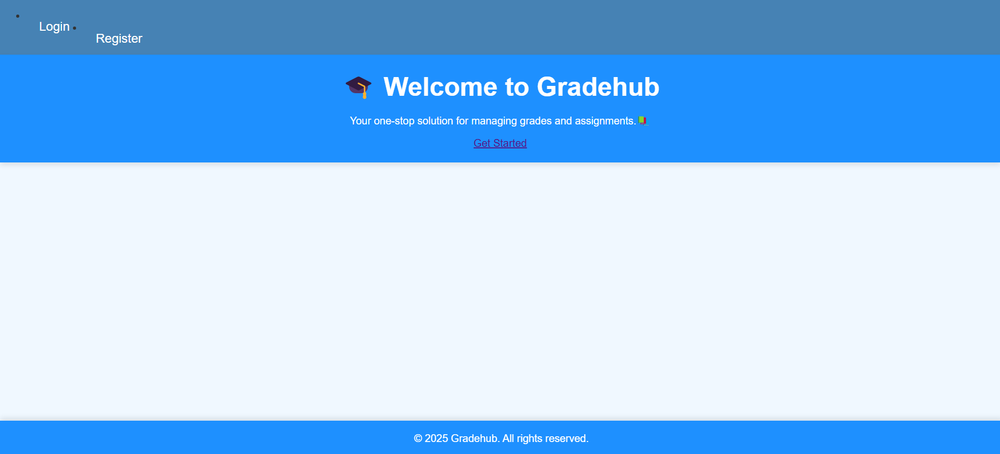
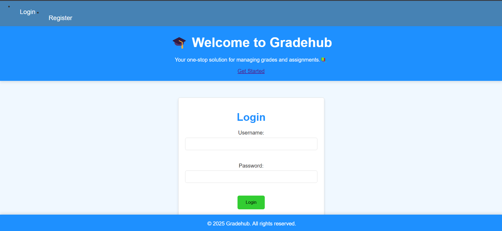
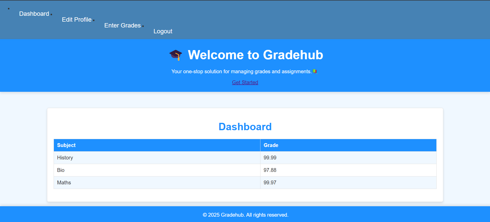

# 📚 Gradehub


## 📝 Project Description

🎉 Gradehub is a web application designed to facilitate user authentication and document sharing, with a focus on educational institutions 📚. It allows users to register, log in, update their profiles, and view grades 📝. The application is built using Flask, a lightweight Python web framework, and utilizes MySQL for database management 📊.

### 🎯 Features

- **🔒 User Authentication**: Secure registration and login system.
- **📝 Profile Management**: Users can update their personal details.
- **📚 Grade Management**: View grades for different subjects.
- **📱 Responsive Design**: Works well on various devices.

### 🛠️ Technologies Used

- **🔙 Backend**: Flask
- **📈 Database**: MySQL
- **📊 Frontend**: HTML, CSS

### 📚 Installation Guide

1. **📁 Clone the repository**:
```sh
git clone "https://github.com/Apratim23/Gradehub.git"
```


## 🖼️ Preview


---

## 📜 License  

Gradehub is open-source and released under the **MIT License**.  
See the [LICENSE](./LICENSE) file for more details.

---

2. **🌟 Create a virtual environment**:
```sh
python -m venv gradehubenv
```


3. **💻 Activate the environment**:
- On Linux/MacOS:
  ```
  source gradehubenv/bin/activate
  ```
- On Windows:
  ```
  gradehubenv\Scripts\activate
  ```

4. **📦 Install dependencies**:
```sh
pip install -r requirements.txt
```


5. **📊 Configure MySQL**:
- Install MySQL Server and MySQL Workbench from the official websites
```yaml
MySQL Server Download Link: https://dev.mysql.com/downloads/installer/
MySQL Workbench Download Link: https://dev.mysql.com/downloads/workbench/
```
- Create a database named `gradehub`.
- #### In MySQL Workbench, create a `user_management` database and use it
```sql
CREATE DATABASE gradehub;
USE gradehub;
```

#### In MySQL Workbench, create a `user` table and a `grades` table and use it 
```sql
CREATE TABLE users (
    id INT AUTO_INCREMENT PRIMARY KEY,
    username VARCHAR(50) NOT NULL,
    email VARCHAR(100) NOT NULL UNIQUE,
    password VARCHAR(255) NOT NULL,
);

CREATE TABLE grades (
    id INT AUTO_INCREMENT PRIMARY KEY,
    user_id INT NOT NULL,
    subject VARCHAR(100) NOT NULL,
    grade DECIMAL(5, 2) NOT NULL,
    FOREIGN KEY (user_id) REFERENCES users(id) ON DELETE CASCADE
);
```

#### In MySQL Workbench, insert into the `grades` table after creating an account using the front end. Do this before logging in.
```sql
INSERT INTO grades (user_id, subject, grade) VALUES (1, '<SUBJECT_NAME>', <GRADE>);
```

### 4️⃣ Environment Variables

#### Create `.env` similar to `.env.example` for Flask Backend connectivity with your MySQL Database server:
```env
SECRET_KEY=mysecretkey # Keep this same, no need to change or delete
MYSQL_HOST=YOUR_MYSQL_SERVER_HOST
MYSQL_USER=root
MYSQL_PASSWORD=YOUR_MYSQL_SERVER_PASSWORD
MYSQL_DB=user_management # Your Database name
```
- Update `app.py` with your MySQL credentials.

6. **🚀 Run the application**:

```sh
python app.py
```


### 🤝 Contributing

Contributions are welcome! 🎉 Please ensure you follow these guidelines:

- **🌟 Fork the repository**.
- **📝 Create a new branch for your feature**.
- **📨 Submit a pull request with detailed changes**.

### 📊 Project Status

- **🔨 Development**: Done
- **🧪 Testing**: Done

### 📚 Sources

- **📖 Flask Documentation**: [Flask Documentation](https://flask.palletsprojects.com/en/2.0.x/)
- **📚 MySQL Documentation**: [MySQL Documentation](https://dev.mysql.com/doc/)

### 📜 License

This project is licensed under the **MIT License** 📜.

### 🙏 Acknowledgments

- Special thanks to [Apratim Dutta](https://github.com/Apratim23) for initial project setup 🙏.
- Contributions from [Contributor Names] 🤝.

### 📸 Screenshots

- **📸 Login Page**: 
- **📸 Dashboard**: 

### 🚀 Future Plans

- **🔒 Implement password hashing for enhanced security**.
- **📚 Add more features for teachers to manage grades**.
- **🎨 Improve frontend design with modern CSS frameworks**.

---

### 🤔 How to Use

1. **📝 Register as a new user**.
2. **🔓 Log in to access your dashboard**.
3. **📝 Update your profile details as needed**.
4. **📚 View your grades for different subjects**.

---

### 📲 Contact

For questions or feedback, please contact [Your Email](mailto:apratimdutta.2003@gmail.com) 📲.
